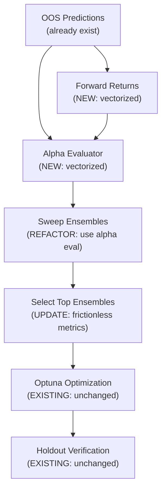

# Workflow C: Decoupled Signal Architecture — Master Implementation Plan

## Goal

Replace the current ensemble evaluation method (running full BacktestEngine subprocess per pair) with a **parameter-agnostic, vectorized signal evaluation** that separates model quality from trade execution. This dramatically reduces compute time for the 64-pair sweep from ~15 minutes to ~5 seconds, eliminates baseline-config bias, and ensures only the mathematically strongest signal combinations reach the expensive Optuna phase.

## Architecture Overview



---

## What Already Exists vs What's New

| Component | Status | File |
|---|---|---|
| OOS predictions (`prob_Buy`/`prob_Sell` CSVs) | ✅ EXISTS | `oos_predictions.csv` per model |
| OHLCV data loading with `RAW_Close` | ✅ EXISTS | [backtest_engine.py L1670-1732](file:///c:/Users/bwang/Documents/GitHub/CL_Analyst_Development/agent/backtest_engine.py#L1670-L1732) |
| Cartesian sweep pairing logic | ✅ EXISTS | [sweep_ensembles.py](file:///c:/Users/bwang/Documents/GitHub/CL_Analyst_Development/agent/sweep_ensembles.py) |
| Top-N selection framework | ✅ EXISTS | [select_top_ensembles.py](file:///c:/Users/bwang/Documents/GitHub/CL_Analyst_Development/agent/select_top_ensembles.py) |
| Sharpe/Sortino numpy helpers | ✅ EXISTS | [strategy_optimizer.py L280-298](file:///c:/Users/bwang/Documents/GitHub/CL_Analyst_Development/agent/strategy_optimizer.py#L280-L298) |
| vectorbt prescreener (pattern reference) | ✅ EXISTS | [strategy_optimizer.py L466-625](file:///c:/Users/bwang/Documents/GitHub/CL_Analyst_Development/agent/strategy_optimizer.py#L466-L625) |
| Optuna strategy optimizer | ✅ EXISTS | [strategy_optimizer.py](file:///c:/Users/bwang/Documents/GitHub/CL_Analyst_Development/agent/strategy_optimizer.py) |
| Batch post-optimizer orchestration | ✅ EXISTS | [batch_post_optimizer.py](file:///c:/Users/bwang/Documents/GitHub/CL_Analyst_Development/agent/batch_post_optimizer.py) |
| Forward returns calculator | 🆕 NEW | `agent/forward_returns.py` |
| Alpha evaluator (frictionless metrics) | 🆕 NEW | `agent/alpha_evaluator.py` |
| Vectorized sweep integration | 🔄 REFACTOR | `agent/sweep_ensembles.py` |
| Selection criteria update | 🔄 MINOR UPDATE | `agent/select_top_ensembles.py` |

---

## Module Breakdown

### Module 1: Forward Returns Calculator

> **Scope:** NEW file · ~80 lines · No dependencies on existing code except OHLCV loader  
> **Can run in parallel with:** Nothing (foundational)

#### [NEW] `agent/forward_returns.py`

**Purpose:** Given an OHLCV DataFrame, compute vectorized N-bar forward returns for multiple horizons.

**Key functions:**
```python
def compute_forward_returns(
    ohlcv: pd.DataFrame,
    horizons: list[int] = [6, 12, 24],  # bars ahead
    price_col: str = "Close"
) -> pd.DataFrame:
    """
    Returns DataFrame with columns like 'fwd_ret_6', 'fwd_ret_12', 'fwd_ret_24'.
    Each value = (Close[t+N] - Close[t]) / Close[t]
    Pure numpy shift + division. No loops.
    """
```

**Implementation notes:**
- Uses `df[price_col].shift(-horizon)` for vectorized forward-looking returns
- Returns percentage returns (not dollar PnL) so results are scale-invariant
- Drops NaN tail rows (last N bars have no forward data)
- The horizons `[6, 12, 24]` correspond to the triple-barrier horizons used in the existing TARGET columns (6H, 12H, 24H)

**Reusable existing code:**
- `load_ohlcv()` from [backtest_engine.py L1670-1732](file:///c:/Users/bwang/Documents/GitHub/CL_Analyst_Development/agent/backtest_engine.py#L1670-L1732) — handles RAW_ column resolution and parquet loading. Import directly, do NOT duplicate.

---

### Module 2: Alpha Evaluator

> **Scope:** NEW file · ~200 lines · Depends on Module 1  
> **Can run in parallel with:** Nothing (depends on Module 1)

#### [NEW] `agent/alpha_evaluator.py`

**Purpose:** Evaluate the raw predictive quality of an ensemble (long model + short model) without any trade execution parameters.

**Key functions:**

```python
def load_prediction_matrix(
    prediction_paths: list[str],
    prob_col: str
) -> pd.DataFrame:
    """Load multiple oos_predictions.csv files, extract prob columns,
    return aligned DataFrame indexed by DateTime."""

def evaluate_ensemble(
    long_probs: pd.Series,    # prob_Buy from long model
    short_probs: pd.Series,   # prob_Sell from short model  
    forward_returns: pd.Series,  # N-bar forward returns
    threshold: float = 0.5
) -> dict:
    """
    Compute frictionless metrics for a single long+short ensemble:
    
    1. Signal Construction:
       - net_signal[t] = long_probs[t] - short_probs[t]
       - Or binary: +1 if long > threshold, -1 if short > threshold, 0 otherwise
    
    2. Frictionless PnL:
       - frictionless_pnl[t] = signal[t] * forward_return[t]
       - Total = sum of frictionless_pnl series
    
    3. Metrics computed:
       - Frictionless Sharpe: mean(daily_pnl) / std(daily_pnl) * sqrt(252)
       - Information Coefficient (IC): spearmanr(signal_strength, forward_return)
       - Signal Frequency: % of bars with |signal| > 0
       - Hit Rate: % of signals where sign(signal) == sign(forward_return)
       - Frictionless PnL: cumulative sum
       - Monthly breakdown: resample to monthly for distribution analysis
    
    Returns dict with all metrics.
    """

def batch_evaluate_ensembles(
    long_models: list[str],      # paths to long model dirs
    short_models: list[str],     # paths to short model dirs  
    ohlcv_path: str,             # path to OHLCV parquet
    horizon: int = 24,           # forward return horizon
    threshold: float = 0.5
) -> pd.DataFrame:
    """
    Cartesian product evaluation of all long × short pairs.
    Returns DataFrame sorted by frictionless_sharpe descending.
    
    This is the main entry point that replaces the subprocess-based
    sweep_ensembles.run_backtest() calls.
    """
```

**Implementation notes:**
- All evaluation is pure numpy/pandas vectorized — no loops over bars
- Predictions and forward returns are pre-aligned by DateTime index using `pd.merge` / `.join(how="inner")`
- The `batch_evaluate_ensembles()` function loads OHLCV once, computes forward returns once, loads all prediction CSVs once, then evaluates all 64 pairs via vectorized operations
- Monthly breakdown output matches the format expected by the enhanced `sweep_ensembles.py` report

**Reusable existing code:**
- `load_predictions()` from [backtest_engine.py L1658-1667](file:///c:/Users/bwang/Documents/GitHub/CL_Analyst_Development/agent/backtest_engine.py#L1658-L1667) — CSV loading with DateTime index parsing
- `_resolve_prob_column()` from [backtest_engine.py L1643-1655](file:///c:/Users/bwang/Documents/GitHub/CL_Analyst_Development/agent/backtest_engine.py#L1643-L1655) — finds prob_Buy/prob_Sell columns case-insensitively
- `compute_sharpe()` / `compute_sortino()` from [strategy_optimizer.py L280-298](file:///c:/Users/bwang/Documents/GitHub/CL_Analyst_Development/agent/strategy_optimizer.py#L280-L298) — numpy-based ratio computation (adapt from equity curve input to monthly PnL input)

---

### Module 3: Refactored Sweep Ensembles

> **Scope:** REFACTOR existing file · ~100 lines changed · Depends on Module 2  
> **Can run in parallel with:** Module 4 (if interface is agreed upon)

#### [MODIFY] `agent/sweep_ensembles.py`

**Current behavior:** Spawns a `subprocess` per pair calling `backtest_engine.py`, parses stdout text with regex. Slow (~15 min for 64 pairs).

**New behavior:** Calls `alpha_evaluator.batch_evaluate_ensembles()` in-process. Vectorized. ~5 seconds for 64 pairs.

**Changes:**

1. **Replace `run_backtest()` function** (current L54-160):
   - DELETE the subprocess-based implementation
   - REPLACE with a thin wrapper around `alpha_evaluator.evaluate_ensemble()`
   - The function signature changes from accepting file paths + config patching to accepting pre-loaded DataFrames

2. **Replace `process_pair()` function** (current L196-221):
   - No longer needs per-thread temp config files or hashlib
   - No longer needs ThreadPoolExecutor (everything is vectorized in batch)
   - Calls `alpha_evaluator.evaluate_ensemble()` directly

3. **Update `main()` function** (current L144-268):
   - Load OHLCV once at the start
   - Compute forward returns once
   - Load all prediction CSVs once into memory
   - Run `batch_evaluate_ensembles()` for the Cartesian product
   - Keep the Markdown report generation (with the new Backtest Information header, Ensemble IDs, and Monthly Breakdowns we just added)

4. **Update report columns:**
   - Replace `Profit Factor` with `Frictionless Sharpe`
   - Replace `Net PnL` with `Frictionless PnL`
   - Replace `Win Rate` with `Hit Rate`
   - Keep `Trades` → rename to `Signal Count`
   - Keep `Holdout PnL` → compute from holdout-period forward returns
   - Add `IC` (Information Coefficient) column

5. **Keep backward compatibility:**
   - Add `--mode` CLI flag: `frictionless` (new default) or `backtest` (legacy)
   - Legacy mode preserves the old subprocess behavior for validation/comparison

**Report format change:**
```markdown
# Backtest Information
- **OHLCV Data:** cl-1h_bk_HourSet_09.parquet
- **Evaluation Period:** 2020-01-01 to 2024-12-31
- **Holdout Period:** 2025-01-01 to 2026-06-09
- **Forward Return Horizon:** 24 bars (24 hours)
- **Evaluation Mode:** Frictionless (parameter-agnostic)

# Ensemble Sweep Results

| Ensemble ID | Long Model | Short Model | Signals | Hit Rate | Frictionless Sharpe | Frictionless PnL | IC | Holdout PnL |
```

---

### Module 4: Updated Selection Criteria

> **Scope:** MINOR UPDATE to existing file · ~15 lines changed · Depends on Module 3 output format  
> **Can run in parallel with:** Module 3 (if column names are agreed upon)

#### [MODIFY] `agent/select_top_ensembles.py`

**Current selection** (L91-98):
```python
# Current: pnl * sqrt(trades) — biased by execution parameters
obj_score = row["Net PnL"] * math.sqrt(row["Trades"])
```

**New selection:**
```python
# New: frictionless Sharpe is the primary ranking metric
# with minimum signal frequency filter
obj_score = row["Frictionless Sharpe"]
```

**Changes:**
1. Update column name parsing to match new report format (`Frictionless Sharpe`, `Frictionless PnL`, `Signals` instead of `Profit Factor`, `Net PnL`, `Trades`)
2. Update filter: `signals >= 50` AND `frictionless_sharpe > 0` (replaces `trades >= 30` AND `pnl > 0`)
3. Sort by `Frictionless Sharpe` descending
4. Keep top N (default 8)
5. Output JSON format stays the same (consumed by `batch_post_optimizer.py`)

---

## What Does NOT Change

> [!IMPORTANT]
> The following components remain completely untouched. The new modules slot in as a drop-in replacement for the sweep/selection phase only.

- **`agent/strategy_optimizer.py`** — Optuna optimization logic, objective functions, trade floor penalties
- **`agent/batch_post_optimizer.py`** — Orchestration of parallel Optuna runs on the Top 8
- **`agent/backtest_engine.py`** — Full trade simulation engine (still used by Optuna in Step 4)
- **`gcp/run_sweep_batch.ps1`** — Windows orchestrator
- **`gcp/vm_sweep_run.sh`** — VM-side model training pipeline
- **`gcp/vm_post_optimize.sh`** — Only the call to `sweep_ensembles.py` changes behavior (same CLI)
- **All manifest/config JSON files** — No schema changes needed
- **Report generation in `batch_post_optimizer.py`** — Final optimized reports unchanged

---

## Open Questions

> [!IMPORTANT]
> These decisions affect the implementation and should be resolved before starting.

1. **Forward return horizon:** The feedback suggests "exactly 24 hours later." Should we match the horizon to each experiment's target (6H, 12H, 24H), or use a single fixed horizon (24H) for all comparisons? Using the target-matched horizon is more precise but means different ensembles aren't directly comparable.

2. **Signal construction method:** Two options:
   - **Binary signals:** Long if `prob_Buy > threshold`, Short if `prob_Sell > threshold` → simpler, closer to actual trading behavior
   - **Continuous signals:** `net_signal = prob_Buy - prob_Sell` → captures confidence magnitude, better for IC measurement
   
   Recommendation: Compute both, rank by continuous-signal Sharpe, but report both in the table.

3. **Holdout cutoff date:** Currently hardcoded as `2025-01-01`. Should this be configurable via the manifest JSON or CLI? The `post_optimizer_holdout_months` field already exists in the manifest (set to 6).

4. **Legacy mode retention:** Should we keep the `--mode backtest` flag permanently for A/B comparison, or deprecate it after one validation run?

---

## Delegated Execution Plan

This plan is designed for a directing agent to delegate to sub-agents. The modules have clean boundaries and can be assigned as follows:

### Task 1 — Foundation (Modules 1 + 2)
**Estimated scope:** ~280 lines of new code across 2 files  
**Dependencies:** None (foundational)  
**Deliverables:**
- `agent/forward_returns.py` with `compute_forward_returns()`
- `agent/alpha_evaluator.py` with `evaluate_ensemble()` and `batch_evaluate_ensembles()`
- Unit tests: `tests/test_forward_returns.py`, `tests/test_alpha_evaluator.py`

### Task 2 — Integration (Module 3)
**Estimated scope:** ~100 lines refactored in existing file  
**Dependencies:** Task 1 must be complete  
**Deliverables:**
- Refactored `agent/sweep_ensembles.py` using alpha evaluator
- Legacy `--mode backtest` flag preserved
- Updated Markdown report format with frictionless metrics

### Task 3 — Selection Update (Module 4)
**Estimated scope:** ~15 lines changed in existing file  
**Dependencies:** Task 2 column names must be finalized  
**Deliverables:**
- Updated `agent/select_top_ensembles.py` with frictionless Sharpe ranking
- Existing JSON output format preserved (consumed by batch_post_optimizer.py)

### Task 4 — Validation
**Estimated scope:** Local test run  
**Dependencies:** Tasks 1-3 complete  
**Deliverables:**
- Run the new frictionless sweep on the existing HourSet_09 data locally
- Compare Top 8 selection against the current backtest-based Top 8
- Verify that `batch_post_optimizer.py` still consumes the output correctly

## Verification Plan

### Automated Tests
```bash
python -m pytest tests/test_forward_returns.py -v
python -m pytest tests/test_alpha_evaluator.py -v
python -m py_compile agent/sweep_ensembles.py
python -m py_compile agent/select_top_ensembles.py
```

### Local Validation
```bash
# Run frictionless sweep locally (should complete in <10 seconds)
python agent/sweep_ensembles.py \
  --base-config configs/strategies/strategy_config_HS09.json \
  --data data/processed/cl-1h_bk_HourSet_09.parquet \
  --long-dir reports/batch_runs/batch_20260609_1120 \
  --short-dir reports/batch_runs/batch_20260609_1120 \
  --output-md reports/test_frictionless_sweep.md \
  --mode frictionless

# Compare against legacy mode
python agent/sweep_ensembles.py \
  --base-config configs/strategies/strategy_config_HS09.json \
  --data data/processed/cl-1h_bk_HourSet_09.parquet \
  --long-dir reports/batch_runs/batch_20260609_1120 \
  --short-dir reports/batch_runs/batch_20260609_1120 \
  --output-md reports/test_legacy_sweep.md \
  --mode backtest
```

### Cloud Validation
- Run a canary batch with the new code
- Verify `vm_post_optimize.sh` calls `sweep_ensembles.py` successfully
- Verify `select_top_ensembles.py` produces valid `top_8_ensembles.json`
- Verify `batch_post_optimizer.py` consumes the JSON and runs Optuna
